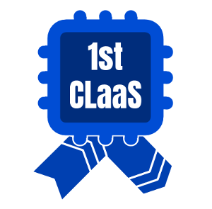
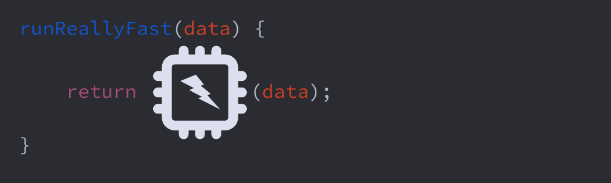
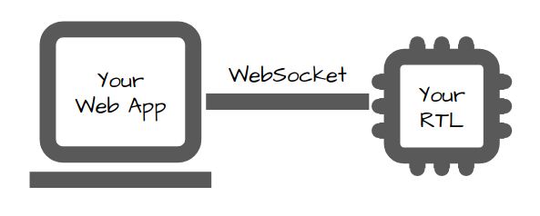
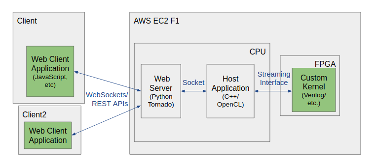

# The 1st CLaaS Framework

#### CLaaS: Custom Logic as a Service

 
## *- Unleashing the 3rd wave of cloud computing!*

  - Wave 1: CPUs
  - Wave 2: GPUs
  - **Wave 3: FPGAs**

Having FPGAs ([Field-Progammable Gate Arrays](Newbies.md)) available in the data center presents enormous potential for new and exciting compute models. But, for this emerging ecosystem to thrive, we need infrastructure to develop custom hardware accelerators for these platforms and integrate them with web applications and cloud infrastructure. The 1st CLaaS Framework brings cloud FPGAs within reach of the open-source community, startups, and everyone.

# Documentation

This README provides an overview of the project. The following documents are also available. After this README, get hand-on with [**Getting Started**](doc/GettingStarted.md).

For local development:

  - [**Getting Started**](doc/GettingStarted.md#top): Instructions to get up and running.
  - [**Developer's Guide**](doc/DevelopersGuide.md#top): Your main development resource.
  
For optimization and deployment of your custom kernel using AWS F1 with Xilinx tools.

  - [**Getting Started with F1**](doc/GettingStartedF1.md#top): Instructions to get up and running with AWS, F1, and Xilinx tools.
  - [**Optimization and Deployment Guide**](doc/F1Guide.md#top): For developing on AWS F1 with Xilinx tools.

# FPGA-Webserver Project Overview

With 1st CLaaS, you can stream bits directly to and from your custom FPGA kernel using standard web protocols (WebSockets or REST). In the simplest use case, all software is client-side in the web browser, and all server logic and data storage is implemented in the FPGA. Your kernel uses a very simple interface to stream the data, and it can be developed in Verilog (or any language compilable to Verilog).

1st CLaaS is ideal for implementing functions in hardware that are compute-limited but tolerant of internet latency and bandwith. Applications requiring a more sophisticated partitioning of responsibilities can extend the host C++ code or Python web server to process data between the web application and FPGA.

Possible application domains might include:

  - voice/image processing/filtering
  - bioinformatics
  - simulation
  - pattern matching
  - machine learning
  - etc.

Your application might be:

  - a web application that includes a hardware-accelerated function
  - a hardware project controlled via a web interface
  - a healthy mix of custom hardware and software

1st CLaaS supports hardware kernel development using free and open source tools on Linux (Ubuntu and CentOS, currently). Deployment is currently targeted to Amazon's F1 FPGA instances. We welcome contributions to extend 1st CLaaS to other platforms and operating systems.

# Project Components

A hardware accelerated web application utilizing this framework consists of:

  - Web Client Application: a web application, or any other agent communicating with the accelerated server via web protocols.
  - Web Server: a web server written in Python using the Tornado library.
  - Host Application: the host application written in C/C++/OpenCL which interfaces with the hardware.
  - FPGA Shell: FPGA logic provided by this framework that builds upon and simplifies the shell logic provided by Xilinx.
  - Custom Kernel: The application-specific FPGA logic.
  

Data is transmitted from the Web Client Application in chunks of 512 bits (currently). JavaScript calls a send method and receives data from Custom Kernel in a callback. Custom Kernel has a simple streaming interface with a 512bit bus of input data and a 512-bit bus for output data. Data travels from JavaScript:
  - as JSON (currently) via WebSocket to Web Server,
  - as JSON (currently) via a UNIX socket to Host Application,
  - as chunks via OpenCL memory buffers to FPGA Shell,
  - as streamed chunks to Custom Kernel,
  - and back, in similar fashion.

Communication performance is not currently the focus. Applications that are well suited to this architecture are inherently compute-limited, so optimizing communication is often unimportant, but the implementation can be optimized as the need arises.

In the simple case, you provide only the green components in the diagram above, and all custom processing of data is performed by the Custom Kernel. But the C++/OpenCL Host Application and/or Python Web Server can be extended as desired.

# Streamlining F1

Prior to this project, integrating FPGA hardware acceleration with web and cloud applications was a daunting undertaking requiring:

  - a full-stack developer
  - a software engineer
  - a domain expert
  - an IaaS expert
  - a hardware designer

By providing the web server, host application code, and kernel shell logic to stream the data between web application and FPGA kernel as well as automating cloud instance creation and configuration, 1st CLaaS reduces your work to:

  - web development, and
  - logic design

<small><small>[CC BY-SA 2.0, <a href="http://www.lumaxart.com/" target="_blank" atom_fix="_">LuMaxArt</a>, modified]</small></small>

Infrastructure development overhead is reduced from several person-months down to hours.

Looking specifically at the Amazon F1 platform, F1 provides powerful Xilinx FPGAs and Xilinx development tools on a pay-per-use basis, which is quite compelling. But the platform is bleeding edge and requires significant expertise to utilize. Our experience with this platform has been a rather painful (and somewhat expensive) one for several reasons:

  - Documentation is often misleading as APIs and infrastructure are evolving.
  - External dependencies are poorly managed, so tutorials break at random.
  - Xilinx tools, Vivado and SDAccel, while powerful, are difficult to learn and use, slow, and arcane.
  - OpenCL is a whole other beast, built for folks who want to design hardware like it's software... which it obviously isn't.
  - Developers must understand AXI protocols and manage AXI controllers.
  - The AWS platform can be intimidating to a newcomer.

We had to go through this pain, but we bundled our work so you wouldn't have to.

To further streamline development, reduce cost, and avoid any dependency on the F1 platform and Xilinx tool stack, we support development on your local machine where the kernel is emulated with RTL simulation using the Verilator open-source RTL simulator. AWS and Xilinx tools are only required for kernel optimization and deployment. As an added bonus, Verilator simulation runs significantly (~100x?!) faster than simulation using the Xilinx "hardware emulation flow," partly because Verilator is fast and partly because we simulate only the Custom Kernel, not including the shell logic surrounding the kernel.

Reducing the problem to web and RTL development is not the finish line for us. 1st CLaaS is a part of a broader effort to redefine the silicon industry and bring silicon to the masses. Getting past the complexities of RTL modeling is part of that. 1st CLaaS is driven by avid supporters of TL-Verilog, in association with <a href="http://redwoodeda.com" target="_blank" atom_fix="_">Redwood EDA</a>. TL-Verilog introduces a much-needed digital circuit design methodology shift with simpler and more powerful modeling constructs. 1st CLaaS is in no way tied to TL-Verilog. You can use Verilog/SystemVerilog or any hardware description language that can be turned into Verilog. But TL-Verilog lnguage extensions are supported out of the box, and we strongly encourage you to take advantage of them and help us drive this innovation forward. Redwood EDA provides a free, online IDE for TL-Verilog development at <a href="http://makerchip.com" target="_blank" atom_fix="_">makerchip.com</a>. You can find training materials in the IDE. Read [the more-complete story](doc/Story.md) from Redwood EDA founder, <a href="https://www.linkedin.com/in/steve-hoover-a44b607/" target="_blank" atom_fix="_">Steve Hoover</a>.

# Status

This repository is generally working, and the initial development push is winding down.

A working <a href="https://github.com/stevehoover/1st-CLaaS/tree/master/apps/mandelbrot" target="_ blank">Mandelbrot explorer</a> is included. This demo is hosted at <a href="http://fractalvalley.net" target="_blank" atom_fix="_">FractalValley.net</a>.

Anything and everything is subject to change at this point, especially with respect to the interface provided by the framework for applications to build upon. So, you should build on a specific version of the framework and expect to do some debugging if you choose to upgrade by pulling from master.

# Main Contributors

  - <a href="https://www.linkedin.com/in/steve-hoover-a44b607/" target="_ blank">Steve Hoover</a>: Project lead/lead developer.
  - <a href="https://www.linkedin.com/in/alessandro-comodi-2a522a65/" target="_ blank">Alessandro Comodi</a>: Early development, in collaboration with the NECSTLab at Politecnico di Milano, under Marco Santambrogio.
  - <a href="https://www.linkedin.com/in/akos-hadnagy/" target="_ blank">Akos Hadnagy</a>: Terraform and Verilator infrastructure sponsored by Google in <a href="https://summerofcode.withgoogle.com/" target="_blank" atom_fix="_">Google Summer of Code</a>, 2019.

# Related Technologies

  - We are considering a unification with [Fletcher](https://github.com/johanpel/fletcher).

# Acclaim and Further Information

  - 1st CLaaS has caught the eye of the open-source silicon community. It has been written up in a number of online publications:
    - Google recognized 1st CLaaS as a game-changer from among 1,134 successfully-completed Google Summer of Code 2019 projects with this <a href="https://opensource.googleblog.com/2019/09/unleashing-open-source-silicon.html" target="_ blank">post in their Google Open Source Blog</a>.
    - <a href="https://abopen.com/news/1st-claas-and-google-summer-of-code-work-to-open-the-floodgates-of-free-and-open-source-silicon/">AB Open reported</a> on the Google post.
    - Gareth Halfacree reported on <a href="https://medium.com/librecores/el-correo-libre-issue-20-161dd5e3b9f9">1st CLaaS in El Correo Libre</a>.
  - 1st CLaaS has been presented at several conferences:
    - An invited talk, called "Unleashing Open-Source Silicon" by Steve Hoover in VSDOpen 2019. (<a href="https://www.youtube.com/watch?v=olMu-reXpDY&t=577s" target="_ blank">video</a>, <a href="https://7d23d460-2749-400d-b005-324f0112e947.filesusr.com/ugd/a8abed_49b0b24a022e43df92ab88af28ad8260.pdf" target="_ blank">slides</a>, <a href="https://www.udemy.com/course/vsdopen2019-vlsi-online-conference/" target="_ blank">all of VSDOpen 2019</a>)
    - A similar <a href="https://www.youtube.com/watch?v=FARF48mjTjI" target="_ blank">invited talk at VSDOpen 2018</a> by Steve Hoover when 1st CLaaS was merely potential.
    - A talk by Akos Hadnagy on <a href="https://www.youtube.com/watch?v=RklNlgQ8AMo" target="_ blank">1st CLaaS at ORConf 2019</a>.
  - Here's a write-up from Steve Hoover on [how 1st CLaaS came to be](doc/Story.md).
  - Akos Hadnagy's provided a [2019 Google Summer of Code Summary](https://www.linkedin.com/pulse/paving-way-fpga-accelerated-web-applications-%25C3%25A1kos-hadnagy/?trackingId=2nssE2INjhEAeFTh7IWUuA%3D%3D).

# Donations

Hmmmm... We haven't given that much thought yet. Just say something nice, and we'll be happy.

# Legal

*All trademarks cited within this repository are the property of their respective owners.*
